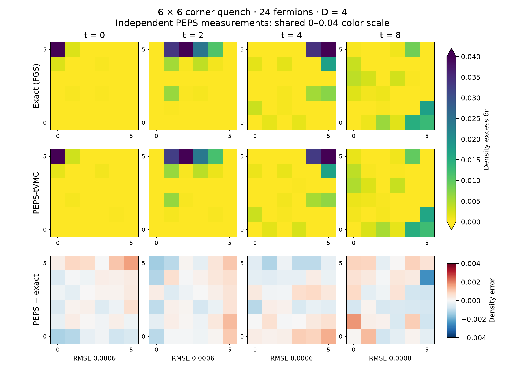

# Fermionic PEPS-tVMC

This example implements the sampled fermionic PEPS method behind Figure 2(b,c) of [PRX Quantum 7, 033035](https://doi.org/10.1103/tggc-8fjx). The main comparison is a **6 x 6, 24-particle, D=4 corner quench**, checked against an independently computed Gaussian solution. At this size, cached exact single-layer PEPS contractions are both more accurate and faster than the tested boundary-MPS contractions; they are used throughout the selected real-time trajectory. The original 12 x 12 FGS benchmark remains in `main.py`; a 3 x 3 PEPS demonstration remains in `run_peps.py`.

## Reused implementations

| Component | Implementation |
| --- | --- |
| Fermion algebra, Hamiltonian and independent sector reference | TenCirPauli `FermionOperator`, mapped Pauli data and `ChargeSector` |
| Exact contraction path search | TensorCircuit-NG `get_contractor`, with a topology-checked cached pairwise path |
| Boundary contraction and shared environments | Existing `examples/peps_boundary_mps.py` |
| Differentiation, tensor operations, vectorization and scans | `tc.backend` |
| Independent Gaussian reference and sampler check | `tc.FGSSimulator` |

The example supplies the parity-block parameter layout, sampled fermionic swap signs, local hole environments, occupation-conserving chains and SR/RK4 composition. It does not construct a 2^36-component state vector. Exact Fock-space sums are used only for tiny validation systems.

## Running the examples

Use an environment containing TensorCircuit-NG, JAX, NumPy, SciPy, Matplotlib, TenCirPauli and OMECO. All numerical runs use `complex128`. The 6 x 6 trajectory is intended for a GPU; the 3 x 3 demonstration and small validation checks can run on a CPU. From the repository root:

```bash
PYTHONPATH=.:examples python examples/reproduce_papers/2026_chern_edge_fgs/validate_peps.py
PYTHONPATH=.:examples python examples/reproduce_papers/2026_chern_edge_fgs/validate_peps_6x6.py --small-check
PYTHONPATH=.:examples python examples/reproduce_papers/2026_chern_edge_fgs/run_peps.py
```

The 6 x 6 driver saves parameters, chains, random state and pre-update diagnostics atomically in bounded chunks. Repeating a command with the same output directory resumes its checkpoint; changing its physical or sampling settings is rejected. `--steps` is the endpoint in that run, so it may be increased to extend a trajectory. `--output-dir` is relative to the script by default and can select a separate run directory.

Ground-state preparation is independent VMC. The recorded refinement starts from the prior VMC checkpoint and performs 50 further Euler SR updates with dt=0.02, 10,240 samples, cap 8 and regulator 1e-4. The supplied preparation checkpoints preserve their configuration and hashes. Reusing a prepared checkpoint avoids repeating the earlier search for a converged initial PEPS; it is not initialization from Gaussian amplitudes.
The recorded refinement can be repeated from the supplied VMC starting state:

```bash
example=examples/reproduce_papers/2026_chern_edge_fgs
PYTHONPATH=.:examples python "$example/run_peps_6x6.py" \
  --stage prepare --initial-state "$example/outputs/6x6/preparation_start.npz" \
  --boundary-dim 8 --samples 10240 --contraction-batch-size 2048 \
  --solver sr --regulator 1e-4 --cg-maxiter 4096 \
  --dt 0.02 --steps 50 --snapshot-every 25 --output-dir outputs/peps-preparation
```

The preceding VMC search is recorded in `outputs/6x6/preparation_provenance.json`; the supplied checkpoint is the reproducible starting point for this refinement, not a claim that the entire earlier parameter search is regenerated by that command.

Run the corner quench from the supplied refined state:

```bash
CUDA_VISIBLE_DEVICES=0,1,2,3 PYTHONPATH=.:examples python "$example/run_peps_6x6_optimized.py" \
  --initial-state "$example/outputs/6x6/initial_state.npz" \
  --contraction-path "$example/outputs/6x6/contraction_path.json" \
  --samples 10240 --contraction-batch-size 10240 \
  --solver dense --regulator 1e-5 --dt 0.2 --steps 40 \
  --snapshot-every 10 --output-dir outputs/peps-evolution
```

The optimized entry point only partitions independent chains across visible JAX devices and replicates the shared tensors and RNG. Contraction batches trade parallelism against temporary memory. The selected exact-contraction run uses full-sample batches on four devices, with about 42.2 GB peak active memory per device in the step benchmark. The single-device entry point is `run_peps_6x6.py`; its default batch of 2,048 bounds intermediate storage. Exact contraction is the default; `--boundary-dim` selects an approximate boundary-MPS cap. Floating-point changes in finite-cap compression can change Metropolis decisions, so different device counts need not give bitwise-identical trajectories.

To regenerate the figure quickly from the saved independent measurements:

```bash
PYTHONPATH=.:examples python "$example/plot_peps_6x6.py" \
  --trajectory "$example/outputs/6x6/trajectory.npz" \
  --measurements "$example/outputs/6x6/measurements/t0.json" \
  "$example/outputs/6x6/measurements/t2.json" \
  "$example/outputs/6x6/measurements/t4.json" \
  "$example/outputs/6x6/measurements/t8.json"
```

To repeat an independent measurement, pass the corresponding saved checkpoint:

```bash
PYTHONPATH=.:examples python "$example/validate_peps_6x6.py" \
  --checkpoint "$example/outputs/6x6/states/t8.npz" \
  --contraction-path "$example/outputs/6x6/contraction_path.json" \
  --samples 4194304 --seed 9147 --output outputs/peps-measurements/t8.json
```

This also writes sampled configurations and amplitude ratios for a fresh audit. The committed measurement files retain compact densities, uncertainties and metadata; the multi-million-configuration scratch arrays are not needed for plotting. The trajectory's own low-sample density diagnostics remain in `trajectory.npz`, separate from the independently remeasured figure.

## Algorithm and conventions

The open Hofstadter lattice uses unit hopping, vertical phase `exp(-2j*pi*x/3)`, filling 2/3, and a pinning potential of -1 at the upper-left corner. Sites are ordered `i = y*columns+x`, with y increasing upward. Only even-total-parity tensor entries are parameters; virtual index parity is `index % 2`. Sampled physical/virtual swap signs implement the fermionic PEPS construction in [arXiv:2506.20106, Eqs. (2), (3), and (8)](https://arxiv.org/abs/2506.20106), reflected vertically to match these coordinates. Fixed particle number is imposed by occupation-conserving sampling, separately from parity.

Imaginary-time VMC minimizes the pinned Hamiltonian. Real-time RK4 removes the pin and multiplies the SR direction by `-i`. The 6 x 6 preparation driver uses Euler SR updates; the small demonstration also supports RK4 preparation. The Gaussian solution never supplies parameter updates or a fitting loss.

For logarithmic amplitude scores O and local energies E, standard SR uses the centered covariance S and force F. The solvers are:

- `sr`: zero-start conjugate gradients using score-matrix products. Storage is O(NP), without P x P or N x N matrices. The true residual of `(S + lambda I)v = F` is recomputed after CG; an unconverged solve produces a nonfinite direction and aborts the trajectory before overwriting its last valid checkpoint. With exact scores, every iterate remains in the centered score row space, implicitly excluding gauge-null directions. Finite-cap hole scores only approximate that property.
- `dense`: an independent reference using a thin analytical gauge basis and Cholesky. It applies gauge projection through thin factors but still stores dense P x P covariance and solve matrices. It is practical at the 6 x 6 parameter count of 5,184; this does not make it a scalable 12 x 12 solver.
- `minsr`: the published **uncentered** sample-space Eq. (17), with the real-time factor in Eq. (18). It is restricted to N < P.

The reported `sr_force_residual_squared` is the squared relative residual of the *unregularized* centered equation, Eq. (26). It is distinct from CG's stopping residual and cannot certify the accuracy of the physical state.

The optional finite boundary cap uses the existing variational boundary-MPS contractor, with two sweeps per row. Scores use local hole environments rather than differentiating through nonholomorphic compression. Horizontal and vertical hopping terms reuse these environments, including their fermionic signs. Sequential exchange sweeps also reuse environments. Their finite-cap conditional probabilities are approximate; the exact-contraction limit preserves the fixed-number Born distribution. The selected exact-contraction trajectory instead uses Metropolis exchanges satisfying detailed balance for the represented PEPS, with two sweeps (120 bond proposals per chain) per sample. Independent measurements still test the resulting physical state.

Exact single-layer contractions remove exterior dimension-one legs and search once with `tc.get_contractor("omeco-8-48")`. The saved pairwise path is checked against the complete network topology and reused through `tc.backend.tensordot`. The optimizer affects contraction cost, not the represented state. `--exact-optimizer` can select another configured TensorCircuit contractor; `--contraction-path` persists the result.

## What the density comparison measures

`validate_peps_6x6.py` draws independent configurations from the exact Gaussian Born distribution q(s)=|phi(s)|² and evaluates the PEPS amplitude psi(s) by **exact** single-layer contraction. With r(s)=psi(s)/phi(s), the PEPS density is the raw self-normalized estimate

`sum(|r|² n_i) / sum(|r|²)`.

Fidelity is estimated independently as `|mean(r)|² / mean(|r|²)`. The Gaussian is only an importance-sampling proposal and reference. No exact-density correction, fitting, spatial smoothing, or interpolation is applied to the PEPS values. Conditional Gaussian sampling uses Wick's rank-one correlation update, checked configuration by configuration against `FGSSimulator`.

Delete-block jackknife errors quantify independent measurement noise. They do not include preparation error, boundary truncation, ansatz bias, or accumulated stochastic integration error. Effective sample size and maximum normalized weight are saved to expose importance-sampling problems. A small sampled SR residual alone is not an accuracy certificate.

The PEPS and FGS maps share the paper's fixed **0 to 0.04** `viridis_r` color scale. Negative density excess and peaks above 0.04 saturate on this display; the saved arrays remain signed and unmodified. A separate residual row shows the density difference without subtracting any sampling-noise estimate.

## Recorded 6 x 6 accuracy

The selected trajectory uses D=4, exact single-layer contractions, 10,240 chains, two Metropolis sweeps per RK stage, dense thin-gauge SR with ridge 1e-5, and RK4 dt=0.2 through t=8. It starts from the independently refined VMC state. The entire real-time trajectory uses the same settings on four A800 GPUs. Each displayed snapshot was remeasured with 4,194,304 independent proposals and seed 9147. These measurements evaluate the represented PEPS with exact contractions; increasing their sample count reduces measurement noise without changing the evolved PEPS.



| Time | Density RMSE | Maximum site error | Infidelity ± sampling standard error | Density standard error, RMS |
| --- | --- | --- | --- | --- |
| 0 | 0.000564 | 0.001626 | 0.000191 ± 4e-07 | 0.000225 |
| 2 | 0.000626 | 0.001402 | 0.000266 ± 9.9e-07 | 0.000225 |
| 4 | 0.000604 | 0.001461 | 0.000475 ± 4.3e-06 | 0.000224 |
| 8 | 0.000776 | 0.002454 | 0.001674 ± 1.2e-05 | 0.000222 |

The largest density-excess peaks occur at (x,y)=(0,5), (2,5), (5,5), and (5,1), respectively, in both the PEPS and exact snapshots.

Errors are computed before display clipping and before subtracting the common background. The shared color limits do not change any saved array. Residual differences include preparation, finite-D variational and stochastic integration errors, as well as measurement noise. Exact contraction of the PEPS does not mean that its variational time evolution is exact.

The same independent t=8 measurement compares the previous best checkpoint with the completed candidates:

| Candidate | Contraction | dt | Ridge | Density RMSE | Maximum site error | Infidelity |
| --- | --- | --- | --- | --- | --- | --- |
| Previous best | Cap 8 | 0.2 | 1e-03 | 0.002545 | 0.008458 | 0.013723 |
| Refined initial state, smaller time step | Cap 8 | 0.1 | 1e-05 | 0.001559 | 0.003604 | 0.009190 |
| Larger boundary cap | Cap 16 | 0.2 | 1e-06 | 0.001845 | 0.003480 | 0.005670 |
| Selected exact-contraction trajectory | Exact | 0.2 | 1e-05 | 0.000776 | 0.002454 | 0.001674 |

Relative to the previous best checkpoint, the selected t=8 RMSE decreases by 3.28x and the largest site error by 3.45x. The candidates change several settings, so this comparison does not isolate a time-step convergence order. Cap 16 improved the state overlap but did not adequately stabilize late-time densities; the cap-8 dt=0.1 trial also retained appreciable late-time error. The full measurements, including these alternatives, are saved in `outputs/6x6/candidate_comparison.json`; their t=8 checkpoints are included under `outputs/6x6/candidates` so the same measurement command can audit them.

A separate contractor audit holds the cap-16 trajectory's t=8 PEPS fixed and compares approximate contractions with exact ones. Across 32 ordinary Gaussian proposal configurations, cap 16 had relative amplitude and score errors of 1.90% and 4.30%; cap 32 reduced them to 0.175% and 0.189%. Errors were larger on eight configurations selected for their large importance ratios. These diagnostic subsets are not an unbiased average over the state, but they expose late-time truncation errors hidden by an accurate initial-state contraction check. The exact contractor removes this source of error, including the approximate sampling probabilities. Audit records and matched step timings are included in `outputs/6x6/benchmarks.json`.

`outputs/6x6/run.json` records the public driver's configuration, complete accepted chunks, source hashes and checkpoint hashes. The saved result comes from one uniform run, which took 24.0 minutes including warmup, JIT and its final low-sample diagnostic. Each subsequent high-statistics measurement took about 3.1 minutes on a GPU. Earlier candidate checkpoints are used only for comparison.

## Solver, memory and contraction measurements

`outputs/6x6/benchmarks.json` records the measurements and their scopes. Timings depend on hardware, compilation caches and concurrent work.

| Check | Measured result |
| --- | --- |
| Physical 6 x 6 scores, N=10,240, P=5,184, ridge 1e-5 | CG needed 2,779 iterations and 6.65 s; true relative linear residual 9.84e-9 |
| Dense thin-gauge solve on the same moments | 0.144 s steady solve time, excluding covariance and gauge construction |
| Dense versus CG physical tangent at ridge 1e-5 | Relative difference 2.24e-4, with finite-cap scores |
| Synthetic 12 x 12 storage check, N=1,024, P=28,224, CPU | 0.462 GB score input and 1.389 GB compiler temporaries; a single dense metric would require 12.746 GB |
| Full 6 x 6 RK4 step, cap 8, dense SR, one A800 | 62.5 s compile, 41.6 s first execution, 41.1 s steady execution |
| Same step on two A800s | 65.0 s compile, 25.8 s first execution, 24.0 s steady execution |
| Full-batch cap-16 RK4 step on four A800s | 63.8 s compile, 65.6 s first execution, 62.3 s steady execution |
| Full-batch exact-contraction RK4 step on four A800s | 17.4 s compile, 34.3 s first execution, 32.2 s steady execution |

The synthetic storage check isolates matrix-free linear algebra; its 12 CG iterations and 2.31 s CPU runtime are **not** representative of physical PEPS scores or the paper's 40,960 samples. At this 6 x 6 size, dense SR is practical and the real-score benchmark favors it. The `sr` option still avoids the parameter-space metric for larger problems. Reducing its regulator without checking physical conditioning can make CG much slower, and an unconverged solve is rejected.

The last two rows use the same t=4 PEPS checkpoint, 10,240 chains, ridge 1e-5 and dt=0.1. The exact-contraction case uses ordinary Metropolis exchanges, while the finite-cap case uses approximate sequential exchanges. Their timings compare complete solver steps with the corresponding samplers, not identical individual operations. Compiler temporaries were 42.15 GB and 19.88 GB per device respectively. The original-size 12 x 12 problem can still require approximate contractions.

The two-device compiler reports 13.36 GB of temporary storage per device, compared with 27.34 GB on one device. Allocator peaks in the microbenchmark are cumulative and should not be confused with those compiler buffers. In the small exact-contraction-limit check, sharding preserves the chains and RNG exactly and differs by 6.3e-15 in parameters. For the finite-cap 6 x 6 check, some Metropolis decisions change: the state infidelity between implementations is 7.4e-9 and their paired density difference is at most 1.94e-6, estimated with 131,072 independent exact-amplitude samples. Whole trajectories therefore require their own independent validation.

The path comparison uses 6 x 6, D=4, one amplitude and all parameter scores on CPU. Both paths are reused after planning:

| Path | Search | Estimated scalar contraction work | Largest intermediate | Steady amplitude + scores | Compiler temporaries |
| --- | --- | --- | --- | --- | --- |
| Greedy | 0.0014 s | 3.23e7 | 65,536 elements | 0.0240 s | 11.67 MB |
| OMECO 8 trials / 48 iterations | 0.229 s | 2.34e6 | 4,096 elements | 0.00941 s | 1.26 MB |

The extra OMECO search cost amortizes after roughly 16 repeated evaluations in this check, excluding the separately recorded JIT cost. The committed contraction path removes search variability when repeating the independent measurements. Reproduce these diagnostic profiles with `run_peps.py --scaling-profile --rows 12 --columns 12 --bond-dim 4 --chains 1024 --draws 1`, or `--path-profile --rows 6 --columns 6 --bond-dim 4 --exact-optimizer greedy` / `omeco-8-48`, using separate output directories and fresh processes.

The recorded numerical environment is listed in `outputs/6x6/environment.json`. Evolution used JAX/JAXlib 0.10.1 with batched GPU QR; independent measurements used 0.9.1. Both used Python 3.11.5, NumPy 2.4.3 and `complex128`. Exact comparisons and checkpoint hashes identify the saved calculation; cross-version or cross-device bitwise equality is not assumed.

## Independent checks

`validate_peps.py` checks fermionic signs and local energies against TenCirPauli's native sector Hamiltonian, complex derivatives, gauge nulls, dense/CG agreement, CG failure handling, RK4 order, boundary contraction, reused environments, sequential sampling, topology validation of cached paths, and parity-preserving bond enlargement. Small-system Fock-space enumeration is confined to validation.

The deterministic RK4 check gives phase-aligned state errors near 2.80e-8 and 1.78e-9 at t=0.04 for steps 0.01 and 0.005. The boundary convergence check recovers exact amplitudes and scores when its cap is sufficient. The checkpoint test compares uninterrupted and resumed preparation, including parameters, chains, RNG state, and diagnostics, with exact array equality.

The original 3 x 3, D=2 reference run remains available as a small CPU demonstration. Its recorded initial energy error is 6.14e-9 and phase-aligned evolution-state error is 1.59e-8 at t=1. Those state errors are separate from its much noisier 1,024-sample plotted density. Favorable tiny-lattice checks do not establish large-lattice accuracy: an earlier 3 x 3, D=4 experiment missed rare configurations dominating its energy variance despite a tiny sampled SR residual.

Repository checks passed on the recorded environment: 2,370 tests passed, 266 were skipped and one was xfailed; Black, Mypy and Pylint passed. The exact-contraction entry point additionally passed an uninterrupted-versus-resumed check with identical parameters, chains, RNG, diagnostics and configuration. Both English and Chinese Sphinx builds completed with confirmed zero exit codes after installing their missing dependencies. Existing documentation warnings remain. `outputs/6x6/validation.json` preserves the summaries and the shell success-footer caveat encountered during validation.

The original paper uses 12 x 12 sites, 96 fermions, D=4, cap 16, 40,960 samples, dt=0.01, and t=12. The 6 x 6 calculation is a scaled method reproduction; it does not reproduce the original-size PEPS trajectory or its reported performance. Finite-size pulse shapes and recurrences differ from the 12 x 12 benchmark.
